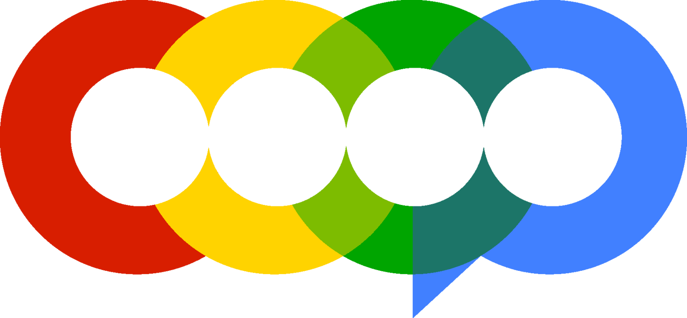

# Hi there, I'm Anita 👋  
## A recent CS grad from SUNY Binghamton and COOP Data Fellow!

I'm a curious builder who’s slowly relearning to love code after burnout.  
I create comforting, quirky apps that solve real-life (and emotional) problems—and explain tech in a way that feels safe.

- 🌱 I’m currently learning DevOps, React Native, and AI-powered app design  
- 🧠 COOP Data Fellow + former coding instructor at Girls Who Code  
- 🛠️ I like making apps that are part productivity tool, part emotional hug  
- ✨ Fun fact: I love mangos, stargazing, and cozy dramas

---

## 🔧 Technologies & Tools

---

## 📂 Projects in Progress

### [Sort My Brain](https://sort-my-brain.vercel.app)  
A cozy journaling tool that turns your emotional chaos into a mood summary, task list, and breathing prompt. Built live during a single chat with ChatGPT.

### [Hey Kiddo Lite](https://hey-kiddo-lite.vercel.app)  
A message simulator where you can talk to a comforting persona like “mom,” “dad,” or a “fairy godmother.” Soft tech for softer days.

### [What Do You Want to Eat?](#) *(coming soon)*  
A decision-helper for the perpetually indecisive. Randomizers, group voting, and AI-powered suggestions.

### [Punch Card Loyalty App](#) *(coming soon)*  
A digital stamp card for small businesses and boba shops. Track visits, earn rewards, and stay loyal.

---

## 🤝 Organizations I'm a Member Of

  

---

## 📫 Let’s Connect!

  
  
